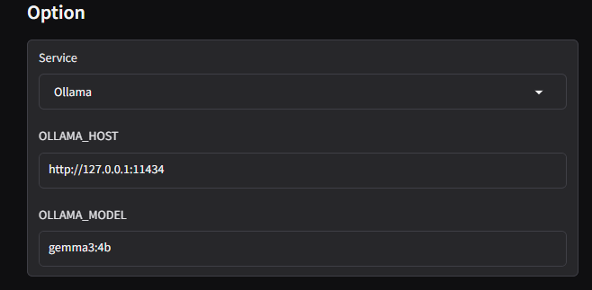

# pdf-eng2jp

英語pdfを日本語pdfにローカルで変換する試み

## 使い方
1. ```
    docker compose up -d --build
    ```
    を実行する．
2. ```
    docker exec -it <ollama_container_id> bash
    ```
    を実行して，ollamaに適切にモデルをpullする．
    今回はgemma3:4bをpullする．
    ```
    ollama pull gemma3:4b
    ```
3. python環境内で
    ``` bash
    pip install pdf2zh

    pdf2zh -i
    ```
    を実行する。

4. ブラウザで
    ```
    localhost:7860
    ```
    アクセスする．

5.  翻訳したいpdfファイルをアップロードする．

    option欄を以下のように設定
    

6. Translate from と Translate to を任意に設定する．

7. Translated から翻訳語のpdfがダウンロードできる．

## 参考
https://github.com/Byaidu/PDFMathTranslate

https://github.com/ollama/ollama

https://hub.docker.com/r/byaidu/pdf2zh

https://hub.docker.com/r/ollama/ollama

https://ollama.com/library/gemma2
